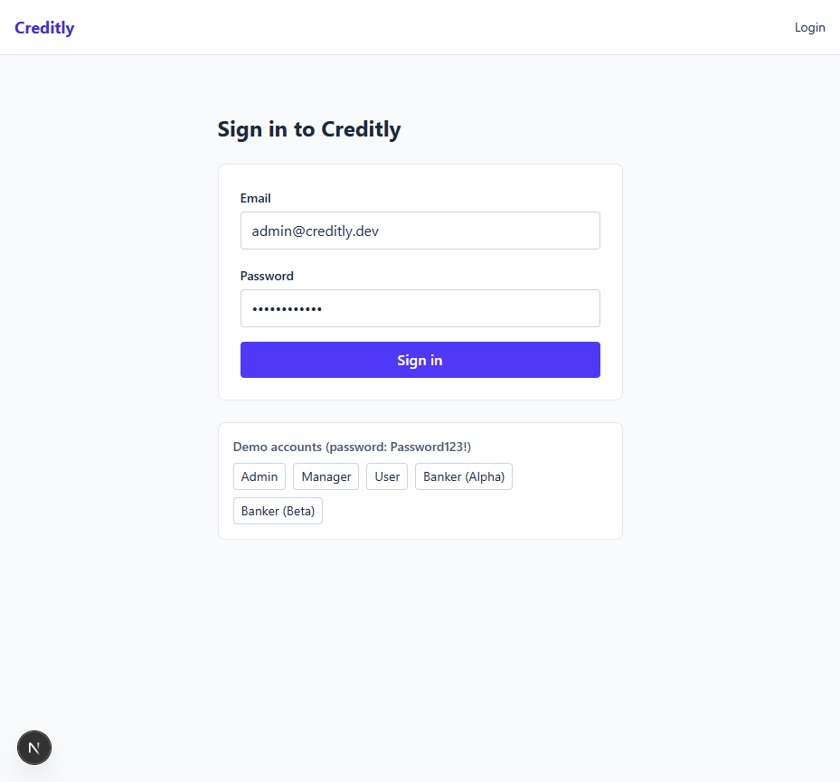
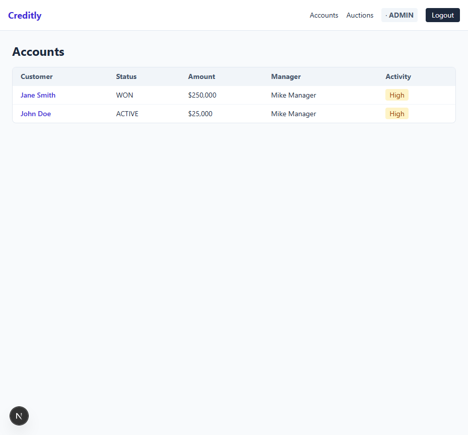
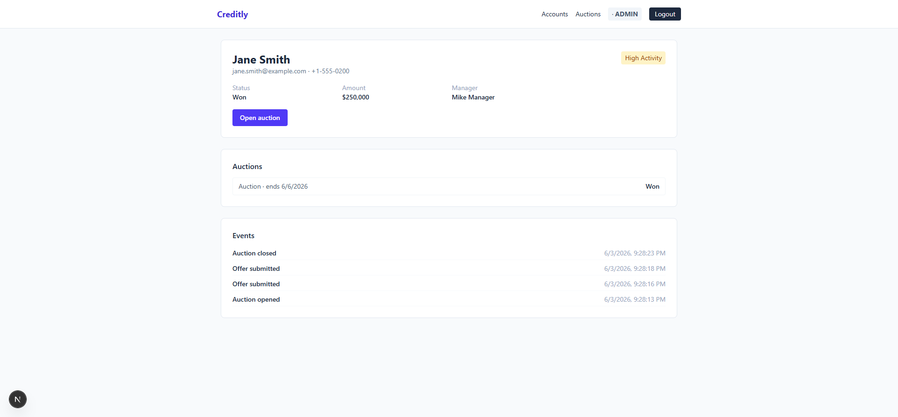
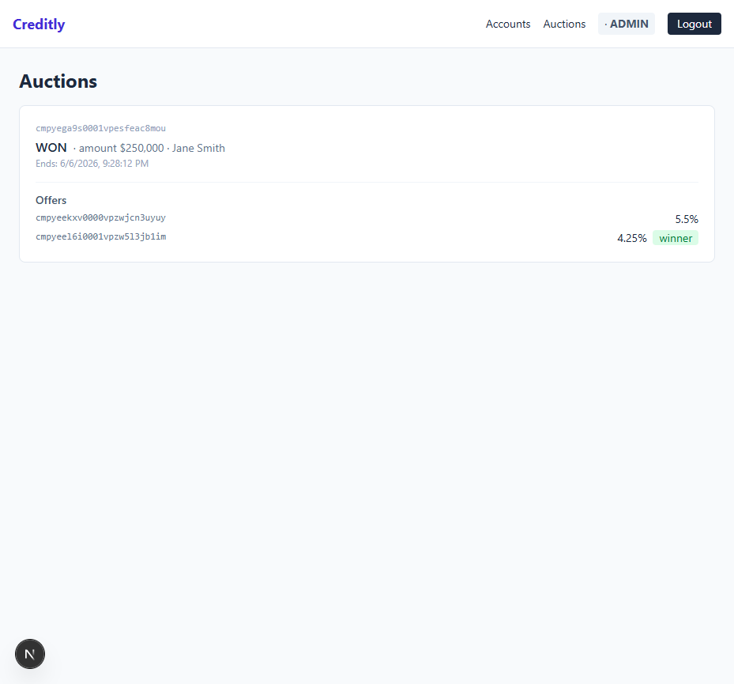
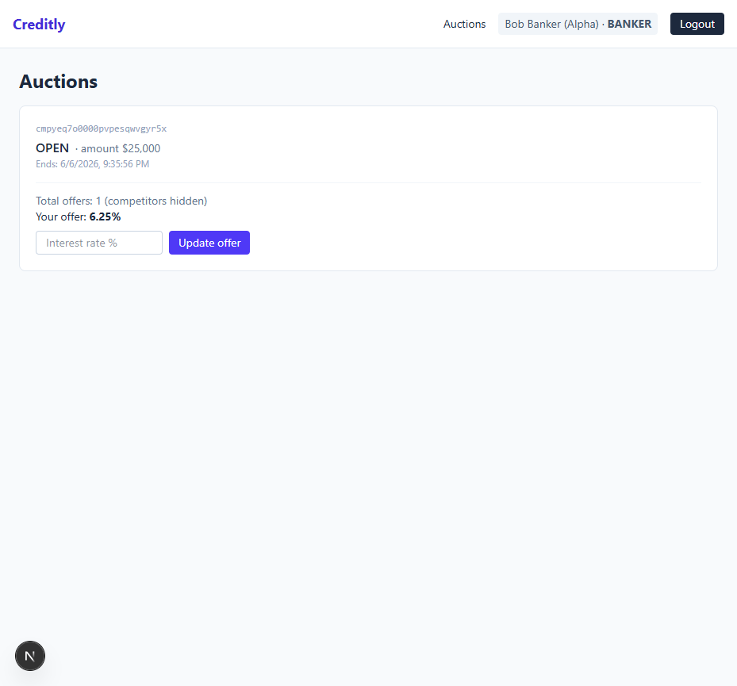

# Creditly — Internal Platform & Banking Auction Module

An internal system to manage customer cases (accounts), system events, and a secure
**banking auction module** with Role-Based Access Control (RBAC). The emphasis is on
**backend architecture, real RBAC, event-driven business logic, and a dedicated
integration layer** — the UI is intentionally minimal.

---

## 🧱 Tech Stack & Decisions

### Backend
- **Runtime / Language:** Node.js + TypeScript (strict)
- **Framework:** **Hono** — a lightweight, first-class-TypeScript web framework. Built-in
  middleware composition, `@hono/zod-validator` for request validation, and `app.onError`
  for centralized error handling. Runs on Node via `@hono/node-server`.
- **Authentication:** JWT (`hono/jwt`), delivered as an httpOnly cookie **and** returned in
  the body so non-cookie clients (and tests) can use a `Bearer` header.
- **Password hashing:** PBKDF2 via Web Crypto (`crypto.subtle`) — runs identically on Node and
  Cloudflare Workers and fits the Workers free-plan CPU budget (chosen over bcrypt for portability).

### Database
- **Database:** PostgreSQL (hosted on **Supabase** — managed Postgres)
- **ORM:** Prisma (type-safe queries + migrations)
- **Why SQL?** The domain needs strict relational integrity between Users, Banks, Accounts,
  Auctions, and Offers, plus **ACID guarantees** for auction matching / tie-breaking. A
  relational engine models this far more safely than a document store.

### Frontend
- **Next.js 15 (App Router) + TypeScript**, Tailwind CSS, Axios, React Context for auth.
- Deliberately basic: role-based navigation, loading/error states, no visual polish.

### Testing
- **Vitest** — 10 focused tests spanning all layers (one fast `npm test`, no DB) — see [Testing](#-testing).

---

## 📐 Architecture (Clean Architecture)

Strict separation of concerns with a one-directional dependency flow:

```
controllers  →  services  →  repositories  →  Prisma
                   │
                   ├── events/        (domain dispatcher + business rules)
                   └── integration/   (Mock CRM sync)
```

```
backend/src/
├── controllers/   # HTTP only: parse input, call a service, shape the response
├── services/      # ALL business logic + orchestration
├── repositories/  # Prisma data access only (no business rules)
├── serializers/   # role-aware DTOs — the single place PII is masked
├── events/        # eventDispatcher: persists events, runs business rules, fires triggers
├── integration/   # crmService: Mock CRM with retry/backoff (never called from controllers)
├── middlewares/   # requireAuth (JWT) + requireRole (RBAC)
├── routes/        # Hono routers + zod validation
├── lib/           # errors, jwt, password, http helpers
├── config/        # env validation, Prisma client
└── app.ts / server.ts
```

**Key rule:** `integration/` and `events/` are invoked **only from services**, never from
controllers. Controllers stay thin; business rules live in one layer.

---

## 🗄️ Database Design

| Entity | Purpose | Key fields |
|---|---|---|
| **User** | System user | `role` (ADMIN/MANAGER/USER/BANKER), `bankId?` (bankers) |
| **Bank** | A bidding bank | `name`, `minAmount` (eligibility threshold) |
| **Account** | Customer case | `customerName/phone/email` (**PII**), `status`, `managerId`, `isHighActivity`, `lastActivity`, `amount` |
| **Event** | System action | `type` (6 types), `payload`, `accountId`, `createdById` |
| **AuctionOpportunity** | Auction entity | `status` (OPEN/CLOSED/EXPIRED/WON), `startsAt`, `endsAt`, `winningOfferId?` |
| **BankOffer** | A bank's bid | `interestRate`, `bankId`, `bankerId`, `isWinner` — `@@unique([auctionId, bankerId])` |
| **SyncLog** | Integration audit | `trigger`, `status` (SUCCESS/FAILED), `failureReason?`, `attempts` |

Relationships: `User 1—* Account` (manager), `Account 1—* Event`, `Account 1—* AuctionOpportunity`,
`AuctionOpportunity 1—* BankOffer`, `Bank 1—* BankOffer`.

**Schema conventions:**
- All enum values are **UPPERCASE** so the DB enum matches the TypeScript enum exactly (no drift).
- Timestamps use `@db.Timestamptz(6)` (sub-millisecond precision) and are **never rounded** —
  the auction tie-break depends on submission order.

---

## 🔐 RBAC (enforced server-side)

Authorization is enforced in the backend at two levels: **`requireRole` middleware** (coarse,
per-endpoint) + **role-aware serializers** (so a banker can never receive PII even by accident).
The frontend only *hides* controls — the server is the source of truth.

| Capability | Admin | Manager | User | Banker |
|---|:--:|:--:|:--:|:--:|
| List / view accounts | ✅ all | ✅ assigned only | ✅ related only | ❌ no direct access |
| Open / close auction | ✅ | ✅ (own accounts) | ❌ | ❌ |
| Create events | ✅ | ✅ | ✅ | ❌ |
| View auctions | ✅ | ✅ | related | ✅ **open + bank-eligible only** |
| Submit offers | ❌ | ❌ | ❌ | ✅ (open, not expired) |
| See customer **PII** | ✅ | ✅ | ✅ | ❌ **masked** |
| See other banks' offers | ✅ | ✅ | — | ❌ |

> **Bankers never see** customer name/phone/email, can't access accounts directly, and see
> only an offer **count** ("competitors hidden") plus their own offer.

---

## ⚖️ Auction Module

**Flow:** account eligible → manager opens auction → eligible bankers see it → bankers submit
offers → manager closes → winner selected.

**Model: Blind** (chosen). Bankers submit offers but cannot see any other offers. This is the
simplest model to implement *correctly* and it directly satisfies the RBAC rule that a banker
must not see competitors' bids. Bankers may **update** their own offer while the auction is open.
- *Trade-off vs Open:* no live competitive price pressure, but stronger confidentiality and a
  simpler, more auditable flow — the right call for a security-focused assignment.

**Rules:**
- Duration = **3 days** (`endsAt = startsAt + 3d`). No offers accepted after `endsAt`.
- **Best offer = lowest interest rate.** Deterministic tie-break:
  `interestRate ASC, createdAt ASC, id ASC` — so equal-rate / same-instant submissions still
  resolve stably and reproducibly (this is a pure, unit-tested function: `services/auctionLogic.ts`).
- No offers → auction `EXPIRED`. Winner chosen → account `WON` + `AUCTION_CLOSED` event +
  `WINNING_OFFER_SELECTED` CRM sync.

---

## ⚙️ Business Logic (mandatory)

Centralized in the **event dispatcher** (`events/eventDispatcher.ts`) and `auctionService`:
- **> 3 events in 24h on an account → `isHighActivity = true`.**
- **`DOCUMENT_UPLOADED` → update `lastActivity` + trigger CRM sync.**
- **Auction close → select best offer** (rules above).

---

## 🔌 Integration Layer (Mock CRM)

A dedicated service (`integration/crmService.ts`), **never called from a controller**. A single
`sync(trigger, payload)` entry point, triggered on `STATUS_CHANGED`, `DOCUMENT_UPLOADED`,
`AUCTION_OPENED`, and `WINNING_OFFER_SELECTED`.

**Bonus — Queue / retry:** each sync is wrapped in a **retry-with-exponential-backoff** loop.
After the final attempt fails, the failure is persisted to **`SyncLog`** with
`status=FAILED`, the `failureReason`, and the number of `attempts`. A configurable
`CRM_FAIL_RATE` env var lets you exercise the failure path.

---

## 🎁 Bonus Features

The assignment lists three optional bonuses. Status in this project:

| Bonus | Status | Where / notes |
|---|---|---|
| **Queue / retry** | ✅ retry implemented | `integration/crmService.ts` — retry + exponential backoff, outcome persisted to `SyncLog`. A durable broker (Redis/RabbitMQ) is **not** included; the retry loop is the documented swap-in point. |
| **Audit trail** | ✅ dedicated `AuditLog` + admin UI | A cross-cutting `AuditLog` records every action (logins incl. failures, offer submit/update with the rate delta, auction open/close, status changes, CRM syncs) with actor + timestamp, surfaced in an admin **Audit Trail** page. Complemented by `Event` (domain) and `SyncLog` (integration). |
| **Cloudflare stack** | ✅ deployed (experiment branch) | Live on Workers — see below + [backend/CLOUDFLARE.md](backend/CLOUDFLARE.md). |

### Queue / retry (✅)
`crmService.sync()` retries up to `CRM_MAX_RETRIES` with `CRM_RETRY_BASE_MS * 2^n` backoff,
then records `SyncLog{ status: FAILED, failureReason, attempts }`. Covered by a unit test.
**Production evolution:** publish events to a durable queue and process via a worker (move the
side-effect off the request path); the dispatcher is the single seam where this is swapped in.

### Audit trail (✅)
- **`AuditLog`** — a comprehensive, admin-only trail of *who did what, when*. A central
  `auditService.record()` captures **logins (success + failure)**, **offer submit/update with the
  rate delta** (e.g. `5.5% → 4.25%`), auction open/close, status changes, document uploads, and CRM
  syncs — each with actor, role, timestamp, and rich metadata. Surfaced at the admin **Audit Trail**
  page (`GET /api/audit`, admin-only) with a per-action filter.
- **`Event`** — domain events on accounts (drives the High-Activity rule + the per-account timeline).
- **`SyncLog`** — every CRM sync attempt (`trigger`, `status`, `failureReason`, `attempts`).
- **Further step:** field-level before/after diffs via Prisma middleware or a Postgres trigger.

### Cloudflare stack (✅ deployed — experiment branch)
The API is **deployed and live** on **Cloudflare Workers** (free plan):
`https://creditly-api.rotem-creditly.workers.dev`. Hono is multi-runtime, so the *same* app runs on
both Node (`server.ts`) and the edge (`worker.ts`) — only a thin platform adapter differs. The
business layers (controllers/services/repositories) are unchanged.
- **API** → `@hono/node-server` is kept for Node; `worker.ts` is the edge entry (`fetch` + `scheduled`).
  Postgres via **`@prisma/adapter-pg` over TCP** (`nodejs_compat`), with a **per-request** client
  (`AsyncLocalStorage`) — Workers can't share a DB socket across requests.
- **Password hashing** → PBKDF2 (Web Crypto), not bcrypt, to stay within the Workers CPU budget.
- **Cron** → a `*/5 * * * *` trigger runs `sweepExpiredAuctions` to auto-close expired auctions.
- **Secrets** → `DATABASE_URL` / `JWT_SECRET` via `wrangler secret put`; non-secret config in `[vars]`.
- **Frontend** → deploy `frontend` (Next.js) to **Cloudflare Pages** (not done in this experiment).

Full write-up: [backend/CLOUDFLARE.md](backend/CLOUDFLARE.md). Request/flow diagrams: [backend/FLOW.md](backend/FLOW.md).

---

## 🌐 API

| Method & Path | Role | Description |
|---|---|---|
| `POST /api/auth/login` | public | Login → JWT (cookie + body) |
| `GET /api/auth/me` | any | Current user |
| `GET /api/accounts` | Admin/Manager/User | List (role-scoped) |
| `GET /api/accounts/:id` | Admin/Manager/User | Detail + events + auctions |
| `POST /api/events` | Admin/Manager/User | Create an event |
| `POST /api/accounts/:id/auctions` | Admin/Manager | Open an auction |
| `GET /api/auctions` | any | List (banker = masked + eligibility-filtered) |
| `GET /api/auctions/:id` | any | Auction detail (role-aware) |
| `POST /api/auctions/:id/offers` | Banker | Submit / update an offer |
| `POST /api/auctions/:id/close` | Admin/Manager | Close → pick winner |
| `GET /api/analytics/summary` | Admin | System summary |

Every endpoint: zod validation → RBAC guard → service. Errors are normalized by `app.onError`
into `{ error, code }`.

---

## 🚀 Getting Started

### Prerequisites
- Node.js 20+ and a PostgreSQL database (this project used a free Supabase project).

### Backend
```bash
cd backend
npm install
cp .env.example .env          # then fill DATABASE_URL / DIRECT_URL / JWT_SECRET
npm run db:migrate            # apply Prisma migrations
npm run db:seed               # seed users, banks, accounts
npm run dev                   # http://localhost:4000
```

> **Supabase + Prisma:** this single long-running server uses the **session connection**
> (port 5432) for `DATABASE_URL` — it's more stable than the transaction pooler (6543), which
> targets serverless/edge and drops idle connections on the free tier (causes intermittent
> `P1001`). `DIRECT_URL` (5432) is used for migrations. Both are in `.env.example`. For a
> serverless/edge deploy, switch `DATABASE_URL` to the 6543 pooler with `?pgbouncer=true`.

### Frontend
```bash
cd frontend
npm install
cp .env.local.example .env.local   # NEXT_PUBLIC_API_URL=http://localhost:4000/api
npm run dev                         # http://localhost:3000
```

### Seeded accounts (password for all: `Password123!`)
| Email | Role | Manages |
|---|---|---|
| `admin@creditly.dev` | ADMIN | — (sees everything) |
| `manager@creditly.dev` | MANAGER | Mike — John Doe, Jane Smith |
| `manager2@creditly.dev` | MANAGER | Sarah — Emma Wilson, Liam Brown |
| `manager3@creditly.dev` | MANAGER | David — Olivia Davis, Noah Miller |
| `user@creditly.dev` | USER | — (related accounts only) |
| `banker.alpha@creditly.dev` | BANKER | Bank Hapoalim — eligible for all auctions |
| `banker.beta@creditly.dev` | BANKER | Bank Leumi — high-value accounts only |

> 3 managers × 2 accounts = 6 customer accounts; each manager sees only their own (scoped RBAC).

---

## 🧪 Testing

**10 focused tests, one fast command** (`npm test` — no DB: repositories are spied and the logic is
pure). The suite deliberately spans every architectural layer instead of piling up redundant cases —
the assignment asks for ≥5; these 10 cover all the mandated areas plus the bonuses, each with a precise intent.

```bash
cd backend
npm test
```

| # | Layer | File | What it verifies |
|---|---|---|---|
| 1 | Domain logic (pure) | `auctionLogic` | Best offer = **lowest interest rate**; ties break by earliest submission, then lowest id (deterministic, reproducible). |
| 2 | Service · RBAC | `rbac` | A **BANKER** cannot list or read accounts → `ForbiddenError` (no route to customer data). |
| 3 | Service · RBAC | `rbac` | A **MANAGER** is scoped to accounts they own — denied on others, allowed on their own. |
| 4 | Serializer · PII | `serializer` | A banker's auction view **omits name/phone/email** and exposes only `myOffers` — never a competitor list (Blind model). |
| 5 | Edge · validation | `validation` | `createEventSchema` accepts **exactly** the Prisma `EventType` set (UPPERCASE) and rejects lowercase/unknown (drift guard). |
| 6 | Business logic | `businessLogic` | A **4th event within 24h** flips the account to `isHighActivity = true` (the >3/24h rule, via the event dispatcher). |
| 7 | Service · auction | `auctionExpiry` | Offers are rejected **past `endsAt`** (`AUCTION_EXPIRED`) and on a **non-OPEN** auction (`AUCTION_NOT_OPEN`); nothing is persisted. |
| 8 | Service · auction | `auctionClose` | Closing an auction marks the **lowest** offer winner, sets the account `WON`, and fires the `WINNING_OFFER_SELECTED` CRM sync. |
| 9 | Integration | `crmService` | A failing CRM call **retries with backoff**, then records `SyncLog{ status: FAILED, failureReason, attempts }`. |
| 10 | Audit (cross-cutting) | `auditService` | The audit timeline **merges `AuditLog` + `SyncLog`** newest-first and normalizes CRM entries. |

Mandated areas all covered — RBAC (#2, #3), banker-cannot-see-PII (#4), best-offer selection (#1),
no-offers-after-expiration (#7), integration-failure handling (#9) — plus business logic (#6),
validation (#5), and the audit-trail bonus (#10).

> Beyond the automated suite, the full flow was verified **live in a browser** against the deployed
> Cloudflare stack: login (+ failed login), the RBAC matrix, PII masking, the High-Activity rule, and
> a complete auction (open → two offers → close → lowest wins, account `WON`, CRM synced) — all
> surfaced in the admin **Audit Trail**.

---

## 🖼️ UI Screenshots

| | |
|---|---|
| **Login** (demo accounts) | **Accounts** (admin) |
|  |  |
| **Account detail** — PII + event timeline + High Activity | **Auctions (Admin)** — full offers + winner |
|  |  |

**Auctions (Banker)** — note: no "Accounts" nav, **no customer PII**, "competitors hidden", own offer only:



---

## 📝 Assumptions & Trade-offs

- **Auth token in body + cookie.** httpOnly cookie is the primary mechanism; the body token
  keeps tests and non-browser clients simple.
- **Single access JWT, no refresh token** (1-day expiry; re-login on expiry). A conscious
  scope decision — the spec requires "Authentication (JWT)" only. Refresh-token rotation +
  server-side revocation would be the production follow-up.
- **Blind auction model** (see above) — confidentiality over live price competition.
- **CRM sync is awaited synchronously** inside services (with retry/backoff) rather than pushed
  to an external broker. In-process keeps it testable without infra; the retry loop is the
  documented place to swap in a real queue.
- **`isHighActivity` is a boolean**, not a multi-level enum — the spec defines only one state
  ("High Activity"), so inventing LOW/MEDIUM with no rules would be misleading.
- **One open auction per account** at a time (guarded on open).
- **Bank eligibility** is modeled simply as `account.amount >= bank.minAmount`.
- **Expiry** is enforced lazily (offers rejected past `endsAt`) and via an explicit close endpoint,
  **plus** a Cloudflare Cron sweeper (`sweepExpiredAuctions`) that auto-closes expired auctions.
- Analytics summary is **admin-only** (system-wide dashboard).

---

## 📊 Evaluation Map

| Criterion | Where |
|---|---|
| Backend architecture | Clean layering, thin controllers, `app.ts`/services/repositories |
| RBAC | `middlewares/rbac.ts` + `serializers/` PII masking + service-level access checks |
| Business logic | `events/eventDispatcher.ts`, `services/auctionService.ts` |
| Auction module | `services/auctionService.ts` + pure `services/auctionLogic.ts` |
| Integration | `integration/crmService.ts` (retry/backoff + SyncLog) |
| Frontend | `frontend/` (role-based, basic) |
| Tests | `backend/tests/` — 10 tests across all layers (`npm test`) |
