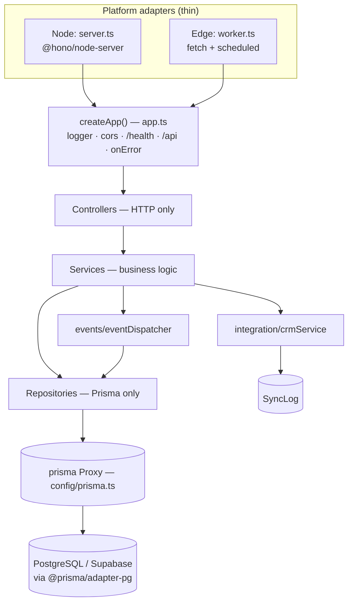
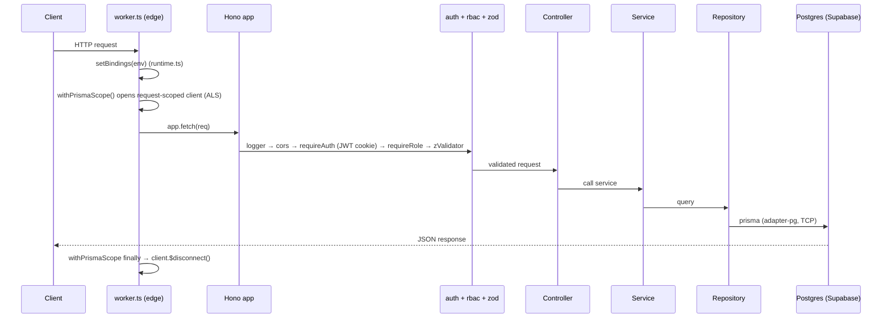
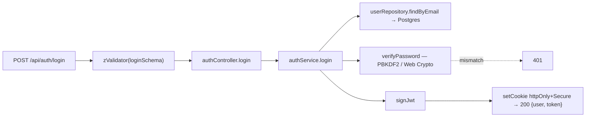
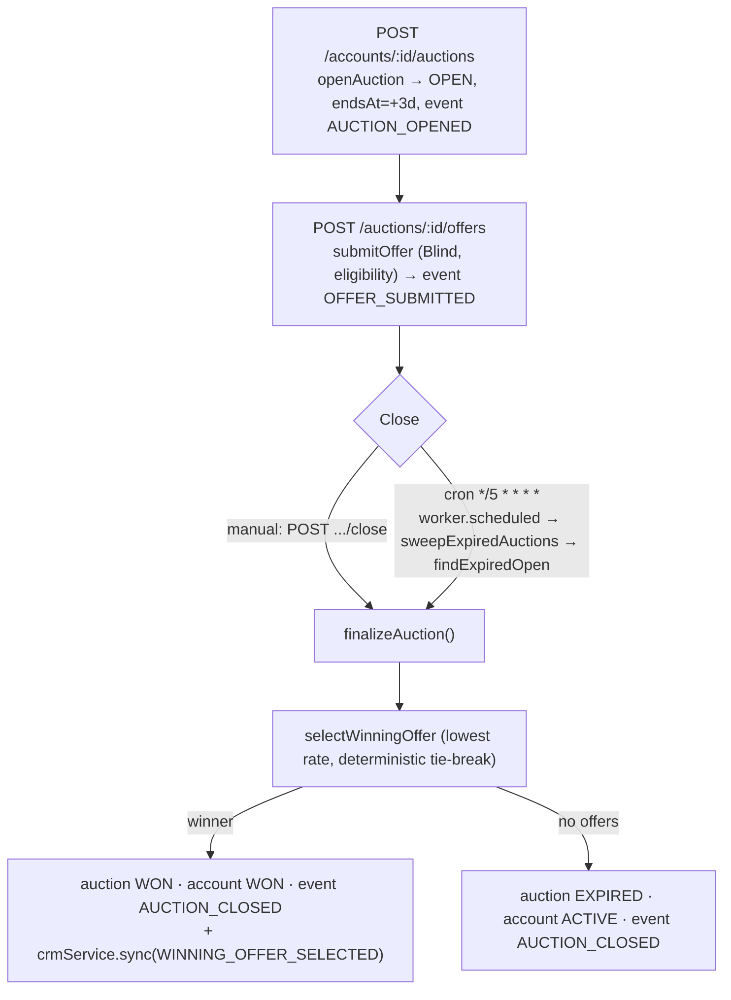
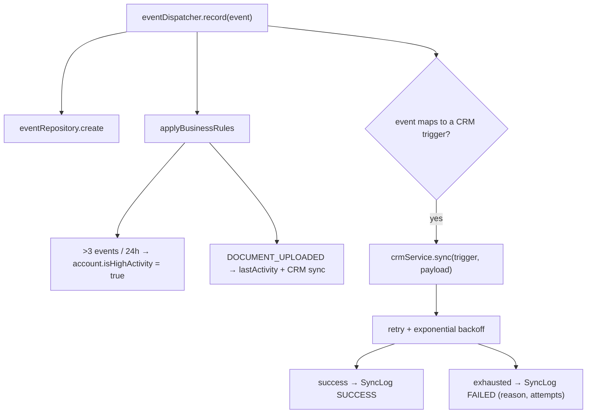

# System Flow — Creditly (Node + Cloudflare Workers)

How a request flows through the system as it stands now. Mermaid diagrams render on
GitHub / in the VSCode preview. File references point to the real code.

## 1. High level — two entry points, one core

Both runtimes are thin platform adapters over the **same** Hono app; the business layers
never know which runtime they run on.

## 2. Request lifecycle (with the edge-specific steps)

`env` and `prisma` are **lazy Proxies** resolved during the request — so the same code runs
on Node and edge. On edge the DB client is created **per request** (sockets can't be shared
across requests in Workers).

## 3. Login flow

PBKDF2 (not bcrypt) so it fits the Workers free-plan CPU budget — see [CLOUDFLARE.md](CLOUDFLARE.md).

## 4. Auction lifecycle + the Cron sweep

Manual close and the cron sweep call the **same** `finalizeAuction` — the cron handler holds
no business logic, it's just another caller.

## 5. Events + CRM integration (the two layers "behind" services)

## RBAC / PII enforcement (server-side, always)

Role-aware serializers ([serializers/index.ts](src/serializers/index.ts)) guarantee a
**BANKER never receives customer PII** (name/phone/email). Enforced in the shared app, so it
holds identically on Node and on the edge.

## Live

Deployed (Workers free plan): `https://creditly-api.rotem-creditly.workers.dev` — see
[CLOUDFLARE.md](CLOUDFLARE.md) for what it took to make the edge path real.
